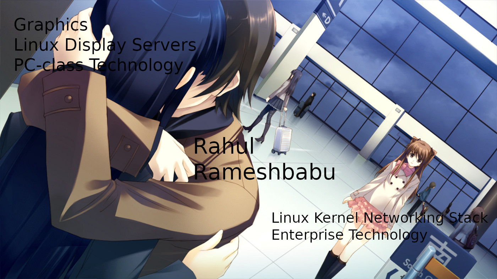
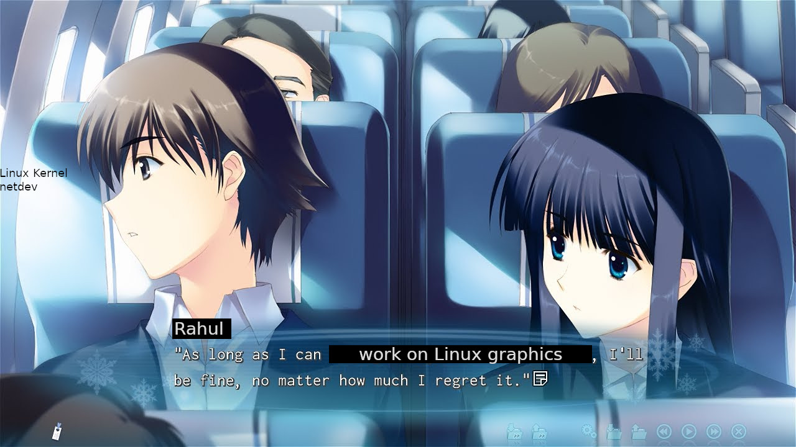

* Changing Jobs

I wanted to announce that I am changing jobs. In my previous role, I worked at
NVIDIA as a Linux kernel developer specifically focused on netdev changes for
the [[https://www.nvidia.com/en-us/networking/ethernet-adapters/][ConnectX]] and [[https://www.nvidia.com/en-us/networking/products/data-processing-unit/][BlueField]] products. You can find my relevant work in my
previous position by [[https://lore.kernel.org/netdev/?q=Rahul+Rameshbabu][searching my name on the netdev mailing list archives]].

I am moving to a new role as part of NVIDIA's Linux Graphics Team. The team's
work involves DRM/KMS, X11 and Wayland UMD work, as well as OpenGL and Vulkan
support. Documentation related to the work can be found at
[[https://download.nvidia.com/XFree86/Linux-x86_64/]].

* Why the change?

I enjoyed the work greatly and loved the interactions with the Linux kernel
netdev team at NVIDIA. The team helped immerse me into the Linux kernel
development process and gave me a means to actively contribute while being able
to pay the bills. I learned a lot from the team about networking, the kernel,
and other related topics. I also got to attend conferences related to the team
and learn a lot from those experiences. It was very difficult for me to consider
parting with the team. The team is part of the Network Business Unit (NBU) at
NVIDIA. This organization consists of companies NVIDIA acquired related to
networking such as [[https://nvidianews.nvidia.com/news/nvidia-to-acquire-mellanox-for-6-9-billion][Mellanox]] and [[https://blogs.nvidia.com/blog/nvidia-acquires-cumulus/][Cumulus]]. The group I worked with was originally
part of Mellanox. My experience with the team makes me genuinely believe that
the Mellanox acquisition was probably the greatest decision NVIDIA has made.

I have been with NVIDIA for a total of five years straight out of college, with
the two of those years being with the Linux netdev team. The truth is that I
joined NVIDIA due to being a fanboy of our work on Linux graphics. I know this
is a polarizing view due to mixed sentiment, but I love the NVIDIA Linux
graphics stack. I first used the NVIDIA Linux graphics drivers back in high
school. Using the ~.run~ file and see the external modules get built against my
Linux install made me aware of the Linux kernel, the module system, and the
existence of userspace display server stack. If the NVIDIA drivers at the time
were upstream and the distros could just magically package everything, I
probably would have never gotten interested in the Linux kernel or low-level
Linux programming.

I always wanted to work on the NVIDIA graphics stack for Linux since I was 16.
It's something that always pops up in my mind so frequently when I pick up a
keyboard and do any coding. This comes from the fact that the NVIDIA Linux
graphics drivers were my inspiration for wanting to code in the first place.
However, I really did lack the skill to do so for a long time. It was thanks to
the experiences I gained over the years that I barely managed to land my dream
role. It came at a cost though. I ended up leaving a great team of talented
people who were willing to work with me and help me grow in terms of my
technical expertise. It almost felt like I was betraying them in the process of
chasing after my dreams. I have taken a scene from my favorite visual novel,
White Album 2, to try to illustrate what I mean.

#+ATTR_HTML: :width 100%

* Highlights from my previous role

I enjoyed my previous role so much. It was very difficult to decide leaving the
team. The team culture is amazing, and I learned so much in these last two years
compared to my first three years at the company.

+ Fix isolation of broadcast traffic and unmatched unicast traffic with MACsec
  offload
  * [[https://lore.kernel.org/all/20240423181319.115860-1-rrameshbabu@nvidia.com/]]
+ ethtool HW timestamping statistics
  * [[https://lore.kernel.org/all/20240403212931.128541-1-rrameshbabu@nvidia.com/]]
  * [[https://lore.kernel.org/all/20240508042418.42260-1-rrameshbabu@nvidia.com/]]
  * [[https://lore.kernel.org/netdev/20240402204000.115081-1-rrameshbabu@nvidia.com/]]
+ mlx5e per-queue coalescing
  * [[https://lore.kernel.org/netdev/20240419080445.417574-1-tariqt@nvidia.com/]]
+ Contributing to the mlx5 driver implementation of PSP offload as part of the
  original PSP patchset to the Linux kernel mailing list
  * [[https://lore.kernel.org/netdev/20240510030435.120935-1-kuba@kernel.org/]]
  * [[https://github.com/google/psp]]
+ ptp .adjphase cleanups
  * [[https://lore.kernel.org/all/20230612211500.309075-1-rrameshbabu@nvidia.com/]]
+ sch_htb: Avoid grafting on htb_destroy_class_offload when destroying htb
  * [[https://lore.kernel.org/all/20230113005528.302625-1-rrameshbabu@nvidia.com/]]

These were some of the more fun/memorable changes I made during my time with
NVIDIA's Linux netdev team for ConnectX/BlueField. The image below depicts my
current feelings as I reflect on these extremely meaningful two years.

#+ATTR_HTML: :width 100%

* What I want to do going forward

I think, from the last section, it should be fairly obvious that my life will
revolve around Linux graphics. Ideally, this will be the case for the rest of my
professional career. Now that I have achieved a path where I can do the work
that I have always dreamed of, it's time to gain mastery in the graphics stack
and use that for NVIDIA. I have been going through some math primers as well as
OpenGL and Vulkan references. Hoping to find some material on display servers,
DRM, and KMS.

* What this means for my blog?

Now that my professional work is more PC-class in nature. This makes it easier
for me to think in terms of making my blogs relatable for those only with
PC-class devices. When working on enterprise-related challenges, it was hard for
me to think about how to scale the debugging techniques I used for PC-class
developers. I expect this means that I will have a large increase in blog
content and post enhancements over time.
