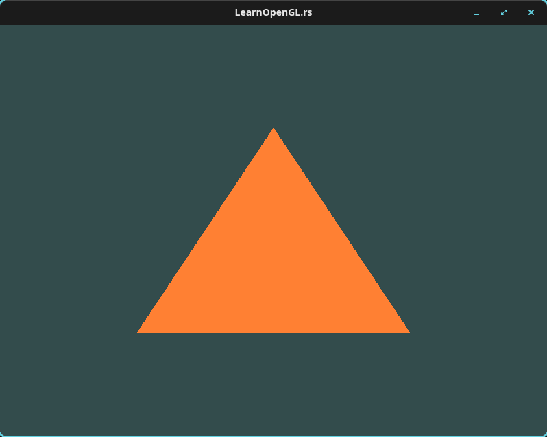
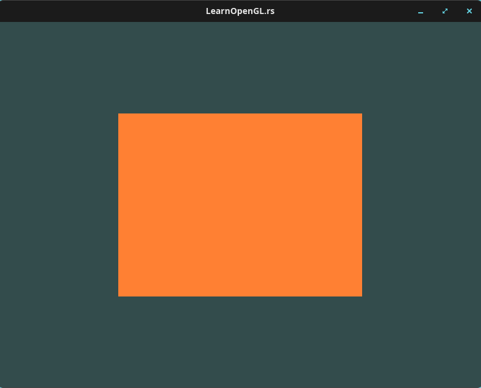
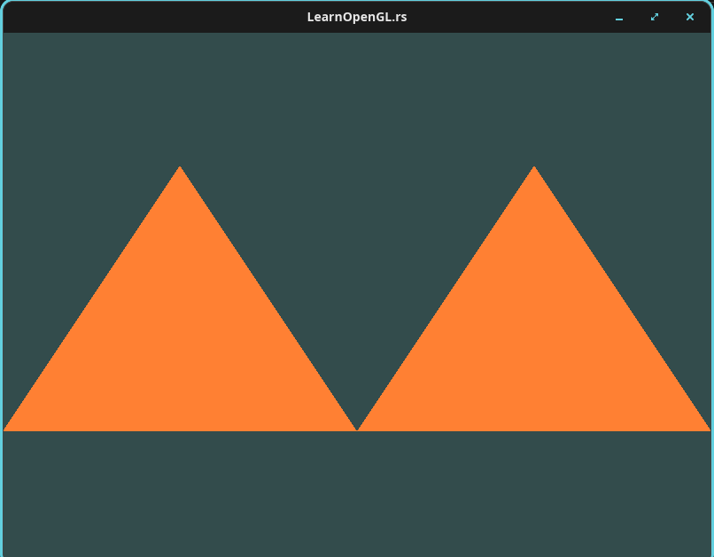
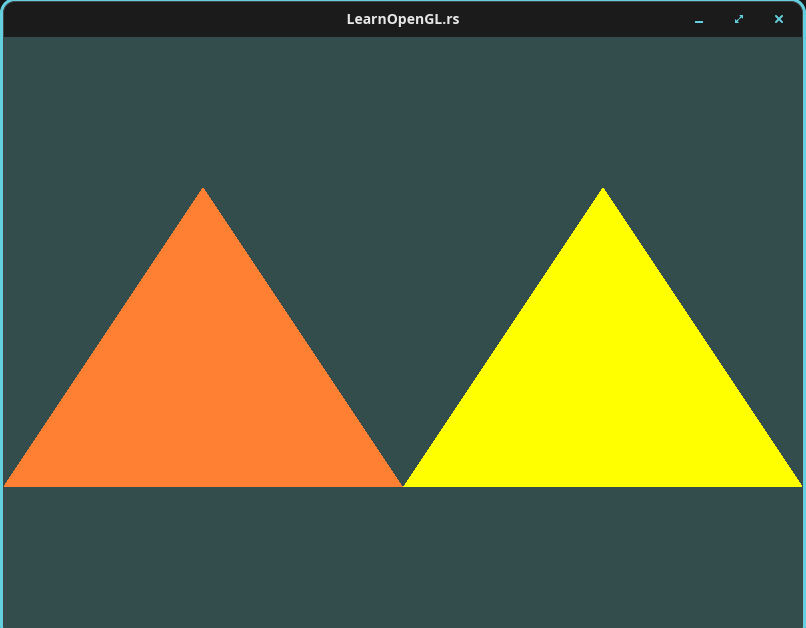

* Picking up where the window left off

This is the second post in my series working through Joey de Vries'
[[https://learnopengl.com][Learn OpenGL]] book while porting the C++ code to
Rust as I go. All of the conceptual material, the pipeline explanations, and the
progression belong to that book; I am just doing the translation and writing
down what surprised me. This post covers the
[[https://learnopengl.com/Getting-started/Hello-Triangle][Hello Triangle]]
chapter, which follows the [[https://learnopengl.com/Getting-started/Hello-Window][Hello Window]]
chapter I covered in the [[/posts/learn-opengl-hello-window/][previous post]].
Go read the book chapter first; I am assuming you have its explanations of the
graphics pipeline and will focus on the Rust side here.

The last chapter was mostly plumbing: a GLFW window, a context, and a screen
cleared to teal. This one is where the actual graphics pipeline shows up, and it
is where the Rust port stops being a one-to-one transcription. Buffers of raw
bytes get handed to the driver, shader source gets shipped across the FFI
boundary as C strings, and OpenGL's error reporting is a set of out-parameters
and a fixed-size ~char~ buffer. Each of those needs a little thought in Rust.

* Vertex input and the VBO

The book starts with three vertices in normalized device coordinates. In Rust
that is a plain array of ~f32~.

#+BEGIN_SRC rust
    let vertices: [f32; _] = [
        /*     x,        y,       z, */
        -0.5_f32, -0.5_f32, 0.0_f32,
         0.5_f32, -0.5_f32, 0.0_f32,
         0.0_f32,  0.5_f32, 0.0_f32,
    ];
#+END_SRC

The ~[f32; _]~ annotation is a small nicety: I get to say "this is an array of
~f32~" and let the compiler infer the length, which keeps me from having to
update a count every time I add a vertex. The ~_f32~ suffixes on the literals
are the moral equivalent of the ~f~ suffix the book uses in C++.

Next we generate a buffer object and upload the data. This is the first place
the FFI boundary bites.

#+BEGIN_SRC rust
    let mut vbo: u32 = 0;
    let mut vao: u32 = 0;
    // SAFETY: Assume the functions are dynamically loaded via the symbol lookup.
    unsafe {
        gl::GenVertexArrays(1, &mut vao);
        gl::GenBuffers(1, &mut vbo);

        gl::BindVertexArray(vao);

        gl::BindBuffer(gl::ARRAY_BUFFER, vbo);
        gl::BufferData(
            gl::ARRAY_BUFFER,
            std::mem::size_of_val(&vertices)
                .try_into()
                .expect("failed to represent usize value as an i32"),
            /*
             * TODO: Might be interesting to debug incorrect size in RenderDoc.
             *
             * vertices
             *     .len()
             *     .try_into()
             *     .expect("failed to represent usize value as an i32"),
            */
            vertices.as_ptr().cast(), /* cast *const f32 into *const c_void */
            gl::STATIC_DRAW,
        );
#+END_SRC

Three things going on here that the C++ version does not have to say out loud.

The size argument is ~std::mem::size_of_val(&vertices)~, not ~vertices.len()~.
In C++, ~sizeof(vertices)~ on a stack array gives you the byte count and there
is nothing to get wrong. In Rust, ~.len()~ on an array is the *element* count,
so reaching for the obvious method would hand OpenGL 9 where it wants 36. I left
the wrong version in as a comment because I think it would be genuinely
instructive to watch what
[[https://renderdoc.org/][RenderDoc]] shows when the driver is told the buffer
is a quarter of its real size.

~size_of_val~ returns a ~usize~, but ~glBufferData~ wants a signed
~GLsizeiptr~, so every size has to go through ~.try_into().expect(...)~. C does
this conversion silently. Rust makes you acknowledge that a ~usize~ might not
fit, which is noisy for a 36 byte buffer but is the same discipline that catches
real truncation bugs elsewhere.

Finally, ~vertices.as_ptr().cast()~ turns a ~*const f32~ into the ~*const
c_void~ the C API expects. ~.cast()~ is the tidier spelling of an ~as~ pointer
cast, and it keeps the constness for you.

* Linking vertex attributes and the VAO

Telling OpenGL how to interpret those bytes is ~glVertexAttribPointer~. The
translation is mechanical, but the last two arguments are worth pointing at.

#+BEGIN_SRC rust
        gl::VertexAttribPointer(
            0,
            3,
            gl::FLOAT,
            gl::FALSE,
            (3 * size_of::<f32>())
                .try_into()
                .expect("failed to represent usize value as an i32"),
            ptr::null(),
        );
        gl::EnableVertexAttribArray(0);
    }
#+END_SRC

~gl::FALSE~ is not a Rust ~bool~; it is OpenGL's ~GLboolean~, a ~u8~. And the
offset argument, which the book writes as the eyebrow-raising ~(void*)0~, is
just ~ptr::null()~ in Rust. That is one case where the Rust version reads
*better* than the original: a null pointer is spelled like a null pointer
instead of a cast integer.

The stride is ~3 * size_of::<f32>()~, mirroring the book's ~3 * sizeof(float)~,
and it goes through the same ~try_into~ dance as before.

Everything from ~gl::BindVertexArray(vao)~ onward is being recorded into the
VAO, which is the whole point of the object: the attribute layout and the
element buffer binding are state we would otherwise have to set up again on
every draw call.

* Shaders as assets, not string literals

The book embeds GLSL in the C++ source as a raw string literal. I put mine in
~assets/shader.vert~ and ~assets/shader.frag~ instead, mostly so my editor
treats them as GLSL.

#+BEGIN_SRC glsl
#version 330 core
layout (location = 0) in vec3 aPos;

void main()
{
    gl_Position = vec4(aPos.x, aPos.y, aPos.z, 1.0);
}
#+END_SRC

#+BEGIN_SRC glsl
#version 330 core
out vec4 FragColor;

void main()
{
    FragColor = vec4(1.0f, 0.5f, 0.2f, 1.0f);
}
#+END_SRC

Rust lets me keep them as separate files without paying for runtime file I/O.
~include_str!~ pulls the contents into the binary at compile time, and
~CString::new~ gives me the NUL-terminated buffer OpenGL wants.

#+BEGIN_SRC rust
    let vertex_shader_source = CString::new(include_str!("../assets/shader.vert"))
        .expect("string slice contains an illegal null byte internally");
#+END_SRC

~CString::new~ can fail if the string already contains an interior NUL byte,
which is not a thing that happens in GLSL source, hence the ~expect~. The value
of this shape is that the shader is still a real file on disk for tooling
purposes, but there is no chance of shipping a binary that cannot find its
shaders at runtime.

* Compiling a shader, and the error-log dance

Compiling is the usual create/source/compile sequence.

#+BEGIN_SRC rust
    // SAFETY: Assume the functions are dynamically loaded via the symbol lookup.
    unsafe {
        vertex_shader = gl::CreateShader(gl::VERTEX_SHADER);
        gl::ShaderSource(
            vertex_shader,
            1,
            &vertex_shader_source.as_ptr(),
            ptr::null(),
        );
        gl::CompileShader(vertex_shader);

        gl::GetShaderiv(
            vertex_shader,
            gl::COMPILE_STATUS,
            ptr::from_mut(&mut success),
        );
        if success == 0 {
            gl::GetShaderInfoLog(
                vertex_shader,
                info_log_isize,
                ptr::null_mut(),
                info_log.as_mut_ptr(),
            );
        }
    }
#+END_SRC

~glShaderSource~ takes an *array* of string pointers, so ~&source.as_ptr()~ is
doing double duty: ~as_ptr()~ gives the ~*const c_char~, and the ~&~ makes it a
one-element array of those. ~ptr::from_mut(&mut success)~ is the explicit way to
produce the out-parameter pointer for the status ~i32~.

The interesting part is what happens with the log buffer.

#+BEGIN_SRC rust
    let mut success: i32 = 0;
    let mut info_log: [i8; 512] = [0; 512];
    let info_log_isize: i32 =
        info_log.len().try_into().expect("failed to represent usize value as an i32");
#+END_SRC

#+BEGIN_SRC rust
    if success == 0 {
        // SAFETY: The i8 values in info_log can safely be represented as u8
        // since the byte values represent characters.
        let char_slice: &[u8; 512] = unsafe { std::mem::transmute(&info_log) };

        let error_string = format!(
            "ERROR::SHADER::VERTEX::COMPILATION_FAILED: {}",
            match std::str::from_utf8(char_slice) {
                Ok(s) => String::from(s),
                Err(e) => format!("Invalid UTF-8 found in error message: {}", e),
            },
        ).trim_end_matches("\0").trim_end().to_string();

        return Err(error_string);
    }
#+END_SRC

In C++ this is a ~char infoLog[512]~ that gets handed straight to ~std::cout~.
In Rust the buffer is ~[i8; 512]~ because that is what ~GLchar~ maps to on this
platform, so getting a ~&str~ out of it takes three steps: reinterpret the ~i8~
bytes as ~u8~, validate that they are UTF-8, and then strip the trailing NUL
padding that the driver left in the unused tail of the buffer. The ~transmute~
is the one genuinely gross bit, though it is a safe reinterpretation here since
~i8~ and ~u8~ have the same layout and we only ever read the bytes as
characters. The ~from_utf8~ check is not just ceremony either; it means a driver
that hands back garbage produces a diagnostic instead of undefined behavior.

Notice that the error path ~return Err(...)~ rather than printing. I changed
~main~'s signature for this chapter.

#+BEGIN_SRC rust
fn main() -> Result<(), String> {
#+END_SRC

A failed shader compile is not a panic-worthy bug in my program, it is a message
from a compiler that lives in the graphics driver. Returning it as an ~Err~ gets
it printed to stderr with a nonzero exit status for free, and it composes if I
later factor the shader loading into its own function.

The fragment shader repeats the same three blocks with ~gl::FRAGMENT_SHADER~ and
a different error prefix. There is an obvious refactor waiting here (a
~compile_shader(kind, source) -> Result<u32, String>~ helper), but the book
writes it out longhand and I wanted the first pass to stay close to the source
material.

* Linking the shader program

Linking follows the same create/attach/link/check pattern.

#+BEGIN_SRC rust
    // SAFETY: Assume the functions are dynamically loaded via the symbol lookup.
    unsafe {
        shader_program = gl::CreateProgram();
        gl::AttachShader(shader_program, vertex_shader);
        gl::AttachShader(shader_program, fragment_shader);
        gl::LinkProgram(shader_program);

        gl::DeleteShader(vertex_shader);
        gl::DeleteShader(fragment_shader);

        gl::GetProgramiv(
            shader_program,
            gl::LINK_STATUS,
            ptr::from_mut(&mut success),
        );
#+END_SRC

The shader objects get deleted immediately after linking, exactly as the book
does: the program has what it needs, and the shaders are just intermediates at
that point. Note that the status query is ~GetProgramiv~ / ~GetProgramInfoLog~
here rather than the ~GetShader*~ variants; they are different entry points for
what looks like the same operation, and mixing them up is a classic way to get a
silently empty log.

* Drawing

The render loop from the last chapter grows three lines.

#+BEGIN_SRC rust
        // SAFETY: Assume the functions are dynamically loaded via the symbol lookup.
        unsafe {
            gl::ClearColor(0.2_f32, 0.3_f32, 0.3_f32, 1.0_f32);
            gl::Clear(gl::COLOR_BUFFER_BIT);
            gl::UseProgram(shader_program);
            gl::BindVertexArray(vao);
            gl::DrawArrays(gl::TRIANGLES, 0, 3);
        }
#+END_SRC

Select the program, bind the VAO that describes the vertex layout, and draw
three vertices as triangles. Nothing Rust-specific to say about this one, which
is a good sign.

* The objects Drop cannot clean up

The pleasant surprise of the last chapter was that ~glfwTerminate~ was
unnecessary because the ~Glfw~ value implements ~Drop~. That does *not* extend
to OpenGL objects, and it is worth being clear about why.

#+BEGIN_SRC rust
    // SAFETY: Assume the functions are dynamically loaded via the symbol lookup.
    unsafe {
        gl::DeleteVertexArrays(1, &vao);
        gl::DeleteBuffers(1, &vbo);
        gl::DeleteProgram(shader_program);
    }
#+END_SRC

A VAO, a VBO, and a shader program are all just ~u32~ handles on the Rust side.
The actual resources live in driver memory, and a bare ~u32~ has no destructor
and no idea it means anything. Rust's ownership model buys us nothing here for
free; the cleanup is as manual as it is in C++. The natural fix is to wrap each
handle in a newtype whose ~Drop~ calls the matching ~gl::Delete*~, which would
recover the RAII behavior. I have deliberately not done that yet, because the
book keeps the raw handles for several more chapters and I want the diffs
against the original to stay legible. It is on the list.

* The result

Putting all of that together gives us the triangle the chapter is named for.

#+ATTR_HTML: :width 60%

That is the orange from the fragment shader, on the teal we set up last time.
The state of the project at this point is
[[https://github.com/Binary-Eater/learn-opengl.rs/commit/68057c3494408aa6ed948e95de59b192ef206600][this commit]]
(or browse the
[[https://github.com/Binary-Eater/learn-opengl.rs/tree/68057c3494408aa6ed948e95de59b192ef206600][full tree at that commit]]).
To run it yourself:

#+BEGIN_SRC shell
git clone https://github.com/Binary-Eater/learn-opengl.rs.git
cd learn-opengl.rs
git checkout 68057c3494408aa6ed948e95de59b192ef206600
cargo run
#+END_SRC

Every stage below is a separate commit in the same repository, so you can swap
the hash in that ~git checkout~ to reproduce any of the pictures that follow.

* Element buffer objects and the rectangle

The last section of the chapter draws a rectangle out of two triangles, and uses
it to motivate element buffer objects. Drawing a rectangle from two independent
triangles means six vertices, two of which are exact duplicates. An EBO lets us
store four unique vertices plus a list of indices into them.

I kept the wasteful version around as a comment for contrast.

#+BEGIN_SRC rust
    /*
     * A world without element buffer objects for drawing a rectangle.
     *
     * let vertices: [f32; _] = [
     *     /*     x,        y,       z, */
     *     // first triangle
     *      0.5_f32,  0.5_f32, 0.0_f32,  // top right
     *      0.5_f32, -0.5_f32, 0.0_f32,  // bottom right
     *     -0.5_f32,  0.5_f32, 0.0_f32,  // top left
     *     // second triangle
     *      0.5_f32, -0.5_f32, 0.0_f32,  // bottom right
     *     -0.5_f32, -0.5_f32, 0.0_f32,  // bottom left
     *     -0.5_f32,  0.5_f32, 0.0_f32,  // top left
     * ];
     */

    let vertices: [f32; _] = [
        /*     x,        y,       z, */
        // first triangle
         0.5_f32,  0.5_f32, 0.0_f32,  // top right
         0.5_f32, -0.5_f32, 0.0_f32,  // bottom right
        -0.5_f32, -0.5_f32, 0.0_f32,  // bottom left
        -0.5_f32,  0.5_f32, 0.0_f32,  // top left
    ];
    let indices: [u32; _] = [
        /* NOTE: indices start from 0 and end at 3 */
        0, 1, 3,   // first triangle
        1, 2, 3,   // second triangle
    ];
#+END_SRC

The index buffer is uploaded the same way the vertex buffer was, just with
~gl::ELEMENT_ARRAY_BUFFER~ as the target.

#+BEGIN_SRC rust
        gl::BindBuffer(gl::ELEMENT_ARRAY_BUFFER, ebo);
        gl::BufferData(
            gl::ELEMENT_ARRAY_BUFFER,
            std::mem::size_of_val(&indices)
                .try_into()
                .expect("failed to represent usize value as an i32"),
            indices.as_ptr().cast(), /* cast *const f32 into *const c_void */
            gl::STATIC_DRAW,
        );
#+END_SRC

And the draw call becomes ~glDrawElements~.

#+BEGIN_SRC rust
            gl::UseProgram(shader_program);
            gl::BindVertexArray(vao);
            /*
             * Can use polygon mode to help with debugging using wireframes
             *
             * wireframe mode: gl::PolygonMode(gl::FRONT_AND_BACK, gl::LINE);
             * default:        gl::PolygonMode(gl::FRONT_AND_BACK, gl::FILL);
             */
            /*
             * ebo is bounded to vao since the vao tracks the last EBO object
             * bound while vao is bound.
             */
            gl::DrawElements(gl::TRIANGLES, 6, gl::UNSIGNED_INT, ptr::null());
            gl::BindVertexArray(0);
#+END_SRC

The comment about the EBO being captured by the VAO is the piece of state
tracking I most wanted written down. We never bind the EBO in the render loop,
yet ~DrawElements~ finds it, because the VAO remembered the last
~ELEMENT_ARRAY_BUFFER~ binding made while that VAO was bound. This is also why
the book warns you not to unbind the EBO while the VAO is still bound. Note the
final argument is ~ptr::null()~ again, standing in for the book's ~0~ offset
into the bound index buffer.

The result is a rectangle, from four vertices and six indices.

#+ATTR_HTML: :width 60%

#+BEGIN_SRC shell
git checkout 5d75001d8ea9da2a43af16460bd84ef8a3baae22
cargo run
#+END_SRC

One bookkeeping note if you go browsing the history: I reverted this commit
right afterwards. The exercises all build on the plain single-triangle program
rather than on the rectangle, so reverting back to the ~68057c3~ state kept each
exercise a small, readable diff instead of a rewrite. The rectangle commit is
still in the history and still checks out and runs; it is just not an ancestor
of the exercise commits.

* Exercise 1: two triangles from one buffer

#+BEGIN_QUOTE
Try to draw 2 triangles next to each other using ~glDrawArrays~ by adding more
vertices to your data.
#+END_QUOTE

This one is nearly free, which is the point of the exercise: more vertices in
the same buffer, and a larger count in the draw call.

#+BEGIN_SRC rust
    let vertices: [f32; _] = [
        /*     x,        y,       z, */
        // left triangle
        -1.0_f32, -0.5_f32, 0.0_f32,
         0.0_f32, -0.5_f32, 0.0_f32,
        -0.5_f32,  0.5_f32, 0.0_f32,
        // right triangle
         0.0_f32, -0.5_f32, 0.0_f32,
         0.5_f32,  0.5_f32, 0.0_f32,
         1.0_f32, -0.5_f32, 0.0_f32,
    ];
#+END_SRC

#+BEGIN_SRC rust
            gl::DrawArrays(gl::TRIANGLES, 0, 6);
#+END_SRC

The ~[f32; _]~ inference earns its keep here; adding three vertices required no
other edit to the declaration. The only real change is the vertex count going
from 3 to 6, and ~size_of_val~ picks up the new buffer size on its own.

#+ATTR_HTML: :width 60%

#+BEGIN_SRC shell
git checkout dc2e1e547e3d10b4deba4b7b4d98938956048467
cargo run
#+END_SRC

* Exercise 2: two triangles from two VAOs

#+BEGIN_QUOTE
Now create the same 2 triangles using two different VAOs and VBOs for their
data.
#+END_QUOTE

Same picture, different plumbing. The single ~vertices~ array splits in two, and
so does every object that referenced it.

#+BEGIN_SRC rust
    let left_triangle_vertices: [f32; _] = [
        /*     x,        y,       z, */
        -1.0_f32, -0.5_f32, 0.0_f32,
         0.0_f32, -0.5_f32, 0.0_f32,
        -0.5_f32,  0.5_f32, 0.0_f32,
    ];
    let right_triangle_vertices: [f32; _] = [
        /*     x,        y,       z, */
         0.0_f32, -0.5_f32, 0.0_f32,
         0.5_f32,  0.5_f32, 0.0_f32,
         1.0_f32, -0.5_f32, 0.0_f32,
    ];

    /* NOTE: could use an array of VBOs and VAOs for a single Gen* call */
    let mut left_triangle_vbo: u32 = 0;
    let mut left_triangle_vao: u32 = 0;
    let mut right_triangle_vbo: u32 = 0;
    let mut right_triangle_vao: u32 = 0;
#+END_SRC

The setup block then runs the bind/upload/attrib sequence twice, once per VAO,
and the render loop draws each in turn.

#+BEGIN_SRC rust
            gl::UseProgram(shader_program);
            gl::BindVertexArray(left_triangle_vao);
            gl::DrawArrays(gl::TRIANGLES, 0, 3);
            gl::BindVertexArray(right_triangle_vao);
            gl::DrawArrays(gl::TRIANGLES, 0, 3);
#+END_SRC

Binding a different VAO swaps out the entire attribute configuration, which is
exactly the payoff the book advertises for VAOs. The ~Gen*~ calls all take a
count and an out-pointer, so as the note in the code says, two ~u32~ variables
could just as well be a ~[u32; 2]~ with a single ~gl::GenVertexArrays(2,
arr.as_mut_ptr())~. I kept them as named variables because
~left_triangle_vao~ reads better than ~vaos[0]~, and there are only two.

The rendered output is pixel-identical to exercise 1, which is the correct
answer.

#+ATTR_HTML: :width 60%
[[./hello-triangle-git-72fbec45e73b.png]]

#+BEGIN_SRC shell
git checkout 72fbec45e73b288a136f4b1388d9d2c4d9ee24a2
cargo run
#+END_SRC

* Exercise 3: two shader programs

#+BEGIN_QUOTE
Create two shader programs where the second program uses a different fragment
shader that outputs the color yellow; draw both triangles again where one
outputs the color yellow.
#+END_QUOTE

A second fragment shader in ~assets/yellow_shader.frag~:

#+BEGIN_SRC glsl
#version 330 core
out vec4 FragColor;

void main()
{
    FragColor = vec4(1.0f, 1.0f, 0.0f, 1.0f);
}
#+END_SRC

It gets compiled with the same block as the first fragment shader, then linked
into its own program that reuses the *same* vertex shader object.

#+BEGIN_SRC rust
    // SAFETY: Assume the functions are dynamically loaded via the symbol lookup.
    unsafe {
        yellow_shader_program = gl::CreateProgram();
        gl::AttachShader(yellow_shader_program, vertex_shader);
        gl::AttachShader(yellow_shader_program, yellow_fragment_shader);
        gl::LinkProgram(yellow_shader_program);

        gl::DeleteShader(vertex_shader);
        gl::DeleteShader(yellow_fragment_shader);
#+END_SRC

That shared vertex shader forced the one non-obvious change in this exercise.
The first program's link block used to delete both of its shaders right after
linking; now the ~gl::DeleteShader(vertex_shader)~ has to move down to *after*
the second program links, because deleting it too early would pull it out from
under the program still waiting to be built. The error paths shift accordingly,
so a failure partway through cleans up whichever shader objects are still
outstanding. This is manual lifetime management with no compiler helping, which
is a nice concrete example of what those ~Drop~ wrappers I keep postponing would
actually buy.

Drawing is then a matter of switching programs between the two draw calls.

#+BEGIN_SRC rust
            gl::UseProgram(shader_program);
            gl::BindVertexArray(left_triangle_vao);
            gl::DrawArrays(gl::TRIANGLES, 0, 3);
            gl::UseProgram(yellow_shader_program);
            gl::BindVertexArray(right_triangle_vao);
            gl::DrawArrays(gl::TRIANGLES, 0, 3);
#+END_SRC

#+ATTR_HTML: :width 60%

#+BEGIN_SRC shell
git checkout c34d22c7ba1eb5ef636f76647a66570ab0d517ab
cargo run
#+END_SRC

* What's next

The thing this chapter makes obvious is how much of ~main~ is now shader
boilerplate: three near-identical compile-and-check blocks and two
link-and-check blocks, all of them managing raw handles by hand. Conveniently,
the next chapter is [[https://learnopengl.com/Getting-started/Shaders][Shaders]],
where the book builds a shader class to hide exactly that. That should be the
first place the Rust port really diverges in structure rather than just in
syntax, since a ~Shader~ type with a ~Drop~ impl and a ~Result~ returning
constructor is a much better fit than a C++ class with a ~cout~ in its
constructor. I will cover it in the next post.

As always, all the conceptual credit here belongs to Joey de Vries and the
[[https://learnopengl.com][Learn OpenGL]] book, specifically the
[[https://learnopengl.com/Getting-started/Hello-Triangle][Hello Triangle]]
chapter. Go support it.
