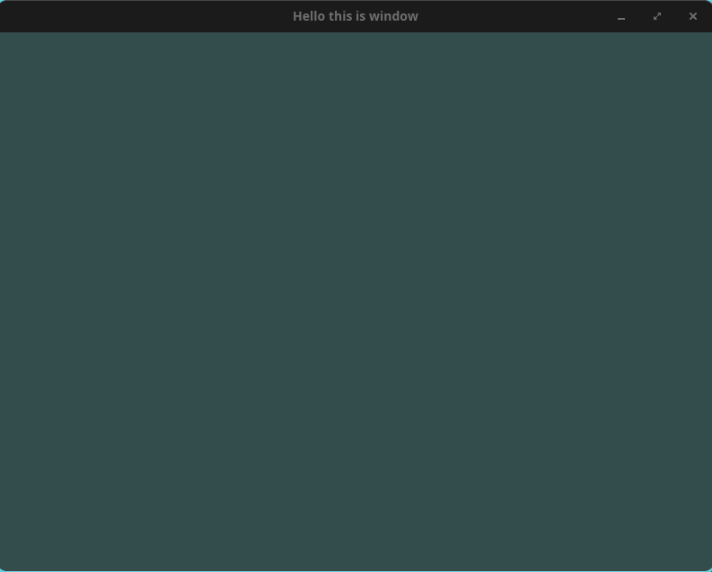

* Following Learn OpenGL, but in Rust

I have been wanting to learn modern graphics programming for a while now. The
resource that consistently gets recommended is Joey de Vries' excellent
[[https://learnopengl.com][Learn OpenGL]] book. It is free, well written, and
builds up an understanding of the OpenGL pipeline one digestible chapter at a
time. All credit for the structure, the explanations, and the progression of
this material goes to that book. I am simply working through it and writing down
what I learn.

There is one twist though. The book is written in C++, and I would rather do
this in Rust. I have been picking up Rust on the side and graphics programming
felt like a great excuse to get more comfortable with it. So my plan is to do
one post per chapter in Learn OpenGL, porting each chapter's C++ code to Rust as
I go. The interesting bits will not be the OpenGL calls themselves (those map
fairly directly), but the places where Rust's ownership model, the ~unsafe~
boundary around the C API, and the crate ecosystem change how the code is
shaped. I will try to call those out as they come up.

If you want to follow the original material alongside these posts, this first
one corresponds to the [[https://learnopengl.com/Getting-started/Hello-Window][Hello Window]]
chapter. Go read it. I will be assuming you have the conceptual explanations
from the book and will focus on the Rust side of things here.

* Picking the crates

The book uses [[https://www.glfw.org/][GLFW]] to create a window and an OpenGL
context, and [[https://glad.dav1d.de/][GLAD]] to load the OpenGL function
pointers. The Rust ecosystem has direct analogs for both.

+ The [[https://crates.io/crates/glfw][~glfw~]] crate gives us safe bindings
  over GLFW.
+ The [[https://crates.io/crates/gl][~gl~]] crate gives us the OpenGL function
  pointers. It plays the role GLAD plays in the book.

My ~Cargo.toml~ dependencies end up looking like this.

#+BEGIN_SRC toml
[dependencies]
raw-window-handle = "0.6.2"
gl = "*"

[dependencies.glfw]
version = "*"
#+END_SRC

* A detour into Nix and static linking pain

Before any OpenGL got drawn, I lost a good chunk of time getting the ~glfw~
crate to build at all inside my ~nix-shell~. The ~glfw-sys~ crate wants to find
GLFW (and its X11 dependencies) through ~pkg-config~, and on NixOS there is no
global ~/usr/lib~ full of libraries for it to discover. The crate also prefers
to statically link, which means it tries to build GLFW from source with CMake.

The real headache is that GLFW's CMake build relies on
[[https://github.com/Kitware/CMake/blob/master/Modules/FindX11.cmake][~FindX11.cmake~]],
which hardcodes lookup paths like ~/var/empty/X11/include~ that simply do not
exist on a Nix system. My workaround was to override the ~cmake~ derivation in
my ~default.nix~ and ~sed~ the real Nix store paths for the X11 headers and
libraries into ~FindX11.cmake~. It is ugly, but it builds GLFW from source
cleanly afterwards.

#+BEGIN_SRC nix
(cmake.overrideAttrs (final: prev: {
  postFixup = prev.postFixup + "\n" + lib.concatStringsSep "\n" [
    "sed -i 's|/var/empty/X11/include|${pkgs.xorg.xorgproto}/include\\n...|' $out/share/cmake-3.30/Modules/FindX11.cmake"
    "sed -i 's|/var/empty/X11/lib|${pkgs.xorg.libX11.out}/lib\\n...|' $out/share/cmake-3.30/Modules/FindX11.cmake"
  ];
}))
#+END_SRC

A cleaner long-term answer is probably a Nix overlay that exposes a statically
linkable ~glfw~ to ~pkg-config~, but I wanted to get drawing rather than yak
shave the build forever. If you are not on NixOS, you can likely ignore all of
this and let the crate find your system GLFW.

* Initializing GLFW

With the build sorted, we can get to the actual chapter. In C++ the book calls
~glfwInit()~ and then sets a handful of window hints. The ~glfw~ crate folds
initialization into a single call that hands back a ~Glfw~ value, and we
configure hints on that value.

#+BEGIN_SRC rust
use glfw::{Context, Window};

fn main() {
    use glfw::fail_on_errors;

    let mut glfw = glfw::init(fail_on_errors!()).unwrap();

    glfw.window_hint(glfw::WindowHint::ContextVersionMajor(3));
    glfw.window_hint(glfw::WindowHint::ContextVersionMinor(3));
    glfw.window_hint(glfw::WindowHint::OpenGlProfile(
        glfw::OpenGlProfileHint::Core,
    ));
#+END_SRC

The ~fail_on_errors!~ macro is the crate's way of supplying an error callback;
it just panics on a GLFW error, which is plenty for following along. The three
hints are the direct equivalent of the book's calls requesting an OpenGL 3.3
core profile context. If you are on macOS, the book notes you also need a
forward-compatibility hint.

* Creating a window and OpenGL context

Next we create the window. In the C++ version this is ~glfwCreateWindow~
followed by ~glfwMakeContextCurrent~. The crate's ~create_window~ returns both
the window and a channel of events as a tuple, which is a nicer shape than the
C API.

#+BEGIN_SRC rust
    let (mut window, _events) = glfw
        .create_window(800, 600, "Hello this is window", glfw::WindowMode::Windowed)
        .expect("Failed to create GLFW window.");

    window.make_current(); /* Equivalent to glfwMakeContextCurrent */
#+END_SRC

I am ignoring the events channel for now with ~_events~ since this chapter does
not consume events that way, but it will become relevant in later chapters.

* Loading the OpenGL function pointers

This is where the ~gl~ crate stands in for GLAD. The book loads function
pointers with ~gladLoadGLLoader((GLADloadproc)glfwGetProcAddress)~. The ~gl~
crate exposes ~gl::load_with~, which takes a closure mapping a symbol name to
its address. We feed it GLFW's ~get_proc_address~.

#+BEGIN_SRC rust
    /* Implement symbol lookup closure for GL functions */
    gl::load_with(|s| window.get_proc_address(s) as *const _);
#+END_SRC

This is the key reason the OpenGL calls later on are wrapped in ~unsafe~. The
functions are resolved dynamically at runtime through this symbol lookup, so
from Rust's point of view we are calling into raw C function pointers. There is
no way for the compiler to guarantee they are valid or that we are calling them
correctly, hence the ~unsafe~ boundary. Once you internalize that the OpenGL API
is just a big table of dynamically loaded C functions, the ~unsafe~ blocks stop
feeling mysterious.

* The viewport and the framebuffer size callback

OpenGL needs to know the dimensions it is rendering into so it can map its
normalized device coordinates (everything between -1 and 1) onto the window. The
book sets this with ~glViewport~ and registers a callback so the viewport tracks
window resizes.

In Rust the callback is a plain function with the signature the crate expects,
and we register it on the window.

#+BEGIN_SRC rust
fn framebuffer_size_callback(_window: &mut Window, width: i32, height: i32) {
    // TIL it's because the functions are dynamically loaded via the symbol lookup...
    unsafe {
        gl::Viewport(0, 0, width, height);
    }
}
#+END_SRC

#+BEGIN_SRC rust
    window.set_framebuffer_size_callback(framebuffer_size_callback);
#+END_SRC

The lone OpenGL call, ~gl::Viewport~, sits inside an ~unsafe~ block for exactly
the reason described above. Everything else here is ordinary safe Rust.

* The render loop

The heart of the program is the render loop. The book's loop checks
~glfwWindowShouldClose~, processes input, issues rendering commands, then swaps
buffers and polls events. The Rust version reads almost identically.

#+BEGIN_SRC rust
    // render loop
    /* Equivalent of glfwWindowShouldClose */
    while !window.should_close() {
        // input
        process_input(&mut window);

        // rendering commands here
        unsafe {
            gl::ClearColor(0.2, 0.3, 0.3, 1.0);
            gl::Clear(gl::COLOR_BUFFER_BIT);
        }

        // check and call events and swap the buffers
        window.swap_buffers();
        glfw.poll_events();
    }
#+END_SRC

~window.should_close()~, ~window.swap_buffers()~, and ~glfw.poll_events()~ map
one to one onto their C counterparts. The rendering commands, ~gl::ClearColor~
and ~gl::Clear~, are again the only thing needing ~unsafe~. ~ClearColor~ sets
the color the screen is wiped to (a nice teal here, the same values the book
uses), and ~Clear~ with ~COLOR_BUFFER_BIT~ actually performs the wipe each
frame. GLFW double buffers for us, so ~swap_buffers~ presents the freshly drawn
back buffer.

* Processing input

The book's ~processInput~ checks whether the escape key is pressed and, if so,
tells the window to close. Rust's pattern matching makes the key state check
read pretty cleanly.

#+BEGIN_SRC rust
fn process_input(window: &mut Window) {
    match window.get_key(glfw::Key::Escape) {
        glfw::Action::Press => window.set_should_close(true),
        _ => (),
    }
}
#+END_SRC

~get_key~ returns a ~glfw::Action~, and we only care about the ~Press~ variant,
falling through on everything else. This is the moral equivalent of the book's
~if~ on ~glfwGetKey(...) == GLFW_PRESS~.

* No glfwTerminate, thanks to Drop

One genuinely pleasant Rust difference is the cleanup. The C++ chapter ends with
an explicit ~glfwTerminate()~ to release the resources GLFW allocated. In the
Rust bindings, the ~Glfw~ value owns those resources and implements the ~Drop~
trait, so termination happens automatically when the value goes out of scope at
the end of ~main~.

#+BEGIN_SRC rust
    /* There is no glfwTerminate call due to Drop trait */
}
#+END_SRC

This is a small thing, but it is a nice illustration of how RAII-style ownership
in Rust removes a category of "did you remember to clean up?" bugs that the C
API leaves to the programmer.

* The result

Putting it all together and running it gives us an 800x600 window cleared to
teal every frame, closing when we hit escape.

#+ATTR_HTML: :width 60%

It is not much to look at yet, but it means GLFW, the OpenGL context, and the
~gl~ function pointers are all wired up correctly. That is the whole point of
this chapter: a known-good foundation to build the actual rendering on top of.

The full state of the project at this chapter lives in
[[https://github.com/Binary-Eater/learn-opengl.rs/commit/c7c9338fc097fc9b9bd3024a92a489320acd0ee6][this commit]]
(or browse the
[[https://github.com/Binary-Eater/learn-opengl.rs/tree/c7c9338fc097fc9b9bd3024a92a489320acd0ee6][full tree at that commit]]).
If you want to check it out and run it yourself, the following should do it.

#+BEGIN_SRC shell
git clone https://github.com/Binary-Eater/learn-opengl.rs.git
cd learn-opengl.rs
git checkout c7c9338fc097fc9b9bd3024a92a489320acd0ee6
nix-shell    # drops you into a shell with the pinned toolchain (skip if not on Nix)
cargo run
#+END_SRC

* What's next

The next chapter in the book is
[[https://learnopengl.com/Getting-started/Hello-Triangle][Hello Triangle]],
where we finally put the graphics pipeline to work and draw something. That is
where vertex buffers, shaders, and the more interesting ~unsafe~ FFI patterns
start showing up, so I expect the Rust translation to get more involved. I will
cover it in the next post.

Once again, all the conceptual credit here belongs to Joey de Vries and the
[[https://learnopengl.com][Learn OpenGL]] book. Go support it.
