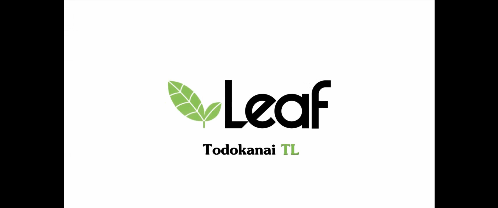
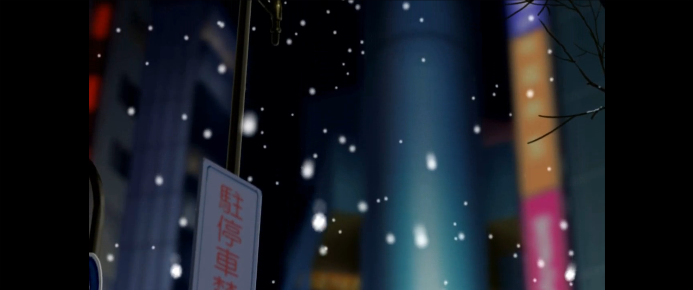
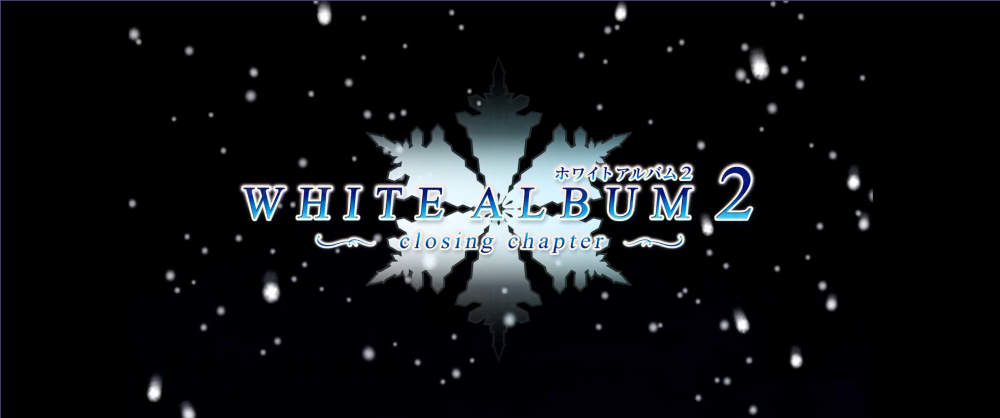
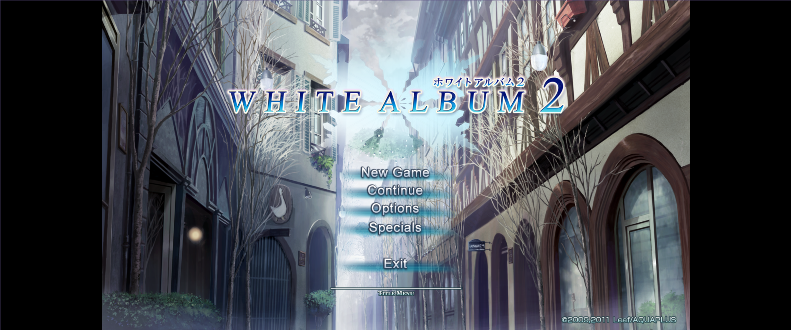

* Playing White Album 2, one of the highest rated visual novels

White Album 2 is a famous visual novel that rivals Steins;Gate and Muv-Luv in
visual novel rankings. Kinoko Nasu's famous visual novels are surprisingly not
as high in the rankings as this novel. The title is probably not as well known
outside of Japan due to lack of an international release and fan translation
only being recently complete (kudos to everyone who contributed to the
~TodokanaiTL~ project). I was first introduced to White Album 2 through the form
of its anime adaptation in late 2013, while I was still in high school. I found
the story compelling but found it to be incomplete. Then, I searched if the show
would ever have a second season. This search showed me that the anime came from
a visual novel, a concept I was not familiar with at the time. This got me into
other visual novels like Fate Stay/Night when I was in high school. However, I
could not play White Album 2 at the time due to a lack of English translations
and difficulty of acquiring the software. White Album 2 Extended Edition is only
sold in physical copies in Japan from what I can tell. Moving onto college and
focusing my career around open source Linux programming left my quite busy for
the next 10 years. During that time, the ~TodokanaiTL~ project made significant
progress and eventually finished translations for the main story and after story
content. As I tried to follow the project's documentation for using ~wine~ with
the game, I found the experience to be subpar. Using ~dxvk~ with the game would
lead to crashes whenever a movie asset finished playing. The movie content in
the game would also not show up correctly. Normal Proton would experience these
issues with the game and the only working recipe people seemed to have been to
vendor some ancient version of Proton-GE. My plan is to play this visual novel
on the Steam Deck, so my goal would be to get the game to play perfectly with at
least Proton Experimental. With the experience I have gained since high school,
it is time to see if I can apply it for the challenge.

* Debugging the game

There are two major issues that impact White Album 2's compatibility with
[[https://github.com/ValveSoftware/Proton][ValveSoftware/Proton]]. This blog and the
[[https://github.com/Binary-Eater/WhiteAlbum2-Proton-patch-scripts][Binary-Eater/WhiteAlbum2-Proton-patch-scripts]] repository assume you are working
the Extended Edition of the game. For general instructions about installing and
patching the game in the first place, please refer to the [[https://todokanaitl.github.io/][TodokanaiTL project
site]] and [[https://todokanaitl.github.io/wa2-wine/][TodokanaiTL Wine install instructions]]. I would recommend getting on
their Discord and checking out their announcements channel because that seems to
be the only reasonable place for finding the latest English translation patches.
You can dismiss the information about locales, winetricks, and gstreamer since
you will be using Proton at the end of the day for launching the game (I assume
if this was not the case, you would not be reading this). You can use Proton
instead of Wine for running the installer by adding the installer executable as
a game entry in your library for installing the game. This is especially useful
on platforms like the Steam Deck. The scripts in this repository are written
such that they will work with SteamOS/the Steam Deck without the user needing to
figure out how to install anything special. All binaries used by the scripts
come with SteamOS.

** White Album 2 seems to crash after the opening movie (the company logo) finishes, hmmmm....

The first things to do in this situation is the following. Invoke the game once
again but configure ~PROTON_WAIT_ATTACH=1 %command%~ under the game's properties
in the "Launch Options" field.

Now, we will use ~gdb~ to attach to the process and dump a backtrace when the
game crashes.

#+BEGIN_SRC shell
  ~ 
  ❯ ps aux | grep WA2.exe
  binary-+   73583  0.0  0.0  28728  5584 ?        S    18:52   0:00 /home/binary-eater/.local/share/Steam/ubuntu12_32/reaper SteamLaunch AppId=3539914974 -- /home/binary-eater/.local/share/Steam/steamapps/common/SteamLinuxRuntime_sniper/_v2-entry-point --verb=waitforexitandrun -- /home/binary-eater/.local/share/Steam/steamapps/common/Proton - Experimental/proton waitforexitandrun /home/binary-eater/.local/share/wineprefixes/wa2/drive_c/Leaf/WHITE ALBUM2/WA2.exe
  binary-+   73584  0.9  0.0   4656  1392 ?        S    18:52   0:00 /home/binary-eater/.local/share/Steam/steamapps/common/SteamLinuxRuntime_sniper/pressure-vessel/libexec/steam-runtime-tools-0/srt-bwrap --args 21 /usr/lib/pressure-vessel/from-host/bin/pressure-vessel-adverb --generate-locales --fd 13 --regenerate-ld.so-cache /var/pressure-vessel/ldso --add-ld.so-path /usr/lib/pressure-vessel/overrides/lib/x86_64-linux-gnu --add-ld.so-path /usr/lib/pressure-vessel/overrides/lib/i386-linux-gnu --set-ld-library-path /usr/lib/pressure-vessel/overrides/lib/x86_64-linux-gnu/aliases:/usr/lib/pressure-vessel/overrides/lib/i386-linux-gnu/aliases --exit-with-parent --subreaper --assign-fd=1=3 --assign-fd=2=4 --shell=none --terminal=none --ld-preload=/home/binary-eater/.local/share/Steam/ubuntu12_32/gameoverlayrenderer.so --ld-preload=/home/binary-eater/.local/share/Steam/ubuntu12_64/gameoverlayrenderer.so -- /home/binary-eater/.local/share/Steam/steamapps/common/SteamLinuxRuntime_sniper/pressure-vessel/bin/steam-runtime-launcher-interface-0 container-runtime /home/binary-eater/.local/share/Steam/steamapps/common/Proton - Experimental/proton waitforexitandrun /home/binary-eater/.local/share/wineprefixes/wa2/drive_c/Leaf/WHITE ALBUM2/WA2.exe
  binary-+   73731  0.3  0.0  23600  4304 ?        Ss   18:52   0:00 /usr/lib/pressure-vessel/from-host/bin/pressure-vessel-adverb --generate-locales --fd 13 --regenerate-ld.so-cache /var/pressure-vessel/ldso --add-ld.so-path /usr/lib/pressure-vessel/overrides/lib/x86_64-linux-gnu --add-ld.so-path /usr/lib/pressure-vessel/overrides/lib/i386-linux-gnu --set-ld-library-path /usr/lib/pressure-vessel/overrides/lib/x86_64-linux-gnu/aliases:/usr/lib/pressure-vessel/overrides/lib/i386-linux-gnu/aliases --exit-with-parent --subreaper --assign-fd=1=3 --assign-fd=2=4 --shell=none --terminal=none --ld-preload=/home/binary-eater/.local/share/Steam/ubuntu12_32/gameoverlayrenderer.so --ld-preload=/home/binary-eater/.local/share/Steam/ubuntu12_64/gameoverlayrenderer.so -- /home/binary-eater/.local/share/Steam/steamapps/common/SteamLinuxRuntime_sniper/pressure-vessel/bin/steam-runtime-launcher-interface-0 container-runtime /home/binary-eater/.local/share/Steam/steamapps/common/Proton - Experimental/proton waitforexitandrun /home/binary-eater/.local/share/wineprefixes/wa2/drive_c/Leaf/WHITE ALBUM2/WA2.exe
  binary-+   73758  0.0  0.1 135128 47164 ?        S    18:52   0:00 python3 /home/binary-eater/.local/share/Steam/steamapps/common/Proton - Experimental/proton waitforexitandrun /home/binary-eater/.local/share/wineprefixes/wa2/drive_c/Leaf/WHITE ALBUM2/WA2.exe
  binary-+   73761  0.0  0.0 564156  9332 ?        Sl   18:52   0:00 /run/pressure-vessel/pv-from-host/bin/steam-runtime-launcher-service --exec-fallback --hint --inside-app --no-stop-on-name-loss --replace --session -- /home/binary-eater/.local/share/Steam/steamapps/common/Proton - Experimental/files/bin/wine64 c:\windows\system32\steam.exe /home/binary-eater/.local/share/wineprefixes/wa2/drive_c/Leaf/WHITE ALBUM2/WA2.exe
  binary-+   73766  0.1  0.0 431328 32232 ?        Sl   18:52   0:00 c:\windows\system32\steam.exe /home/binary-eater/.local/share/wineprefixes/wa2/drive_c/Leaf/WHITE ALBUM2/WA2.exe
  binary-+   74072  0.0  0.0   8724  2728 pts/0    S+   18:53   0:00 grep WA2.exe

  ~ 
  ❯ sudo gdb
  [sudo] password for binary-eater: 
  GNU gdb (GDB) 14.2
  Copyright (C) 2023 Free Software Foundation, Inc.
  License GPLv3+: GNU GPL version 3 or later <http://gnu.org/licenses/gpl.html>
  This is free software: you are free to change and redistribute it.
  There is NO WARRANTY, to the extent permitted by law.
  Type "show copying" and "show warranty" for details.
  This GDB was configured as "x86_64-unknown-linux-gnu".
  Type "show configuration" for configuration details.
  For bug reporting instructions, please see:
  <https://www.gnu.org/software/gdb/bugs/>.
  Find the GDB manual and other documentation resources online at:
      <http://www.gnu.org/software/gdb/documentation/>.

  For help, type "help".
  Type "apropos word" to search for commands related to "word".
  (gdb) set follow-fork-mode child 
  (gdb) attach 73766
  Attaching to process 73766
  [New LWP 73835]
  [Thread debugging using libthread_db enabled]
  Using host libthread_db library "/nix/store/c10zhkbp6jmyh0xc5kd123ga8yy2p4hk-glibc-2.39-52/lib/libthread_db.so.1".
  0x00007f61a3cb078c in select () from target:/usr/lib/pressure-vessel/overrides/lib/x86_64-linux-gnu/libc.so.6
  (gdb) c
  Continuing.
  Error while mapping shared library sections:
  `target:/home/binary-eater/.local/share/wineprefixes/wa2/drive_c/Leaf/WHITE ALBUM2/WA2.exe': Shared library architecture i386 is not compatible with target architecture i386:x86-64.
  Error while mapping shared library sections:
  `target:/home/binary-eater/.local/share/wineprefixes/wa2/drive_c/Leaf/WHITE ALBUM2/WA2.exe': Shared library architecture i386 is not compatible with target architecture i386:x86-64.
  Error while mapping shared library sections:
  `target:/home/binary-eater/.local/share/wineprefixes/wa2/drive_c/Leaf/WHITE ALBUM2/WA2.exe': Shared library architecture i386 is not compatible with target architecture i386:x86-64.
  Error while mapping shared library sections:
  `target:/home/binary-eater/.local/share/wineprefixes/wa2/drive_c/Leaf/WHITE ALBUM2/WA2.exe': Shared library architecture i386 is not compatible with target architecture i386:x86-64.
  [Attaching after Thread 0x7f61a37acf80 (LWP 73766) fork to child process 74223]
  [New inferior 2 (process 74223)]
  [Detaching after fork from parent process 73766]
  [Inferior 1 (process 73766) detached]
  [Thread debugging using libthread_db enabled]
  Using host libthread_db library "/nix/store/c10zhkbp6jmyh0xc5kd123ga8yy2p4hk-glibc-2.39-52/lib/libthread_db.so.1".
  [Attaching after Thread 0x7f61a37acf80 (LWP 74223) fork to child process 74224]
  [New inferior 3 (process 74224)]
  [Detaching after fork from parent process 74223]
  [Inferior 2 (process 74223) detached]
  [Thread debugging using libthread_db enabled]
  Using host libthread_db library "/nix/store/c10zhkbp6jmyh0xc5kd123ga8yy2p4hk-glibc-2.39-52/lib/libthread_db.so.1".
  process 74224 is executing new program: /home/binary-eater/.local/share/Steam/steamapps/common/Proton - Experimental/files/bin/wine-preloader
  [Thread debugging using libthread_db enabled]
  Using host libthread_db library "/nix/store/c10zhkbp6jmyh0xc5kd123ga8yy2p4hk-glibc-2.39-52/lib/libthread_db.so.1".
  [New Thread 0x206fb40 (LWP 74231)]
  [New Thread 0x2c3fb40 (LWP 74234)]
  [New Thread 0xf1fffb40 (LWP 74236)]
  [Thread 0x2c3fb40 (LWP 74234) exited]
  [New Thread 0xdfc98b40 (LWP 74246)]
  [New Thread 0xde273b40 (LWP 74247)]
  <output omitted...>

  Thread 3.1 "WA2.exe" received signal SIGSEGV, Segmentation fault.
  [Switching to Thread 0xf7860b00 (LWP 74224)]
  0x00000000 in ?? ()
  (gdb) bt
  #0  0x00000000 in ?? ()
  #1  0x794f09d9 in vmr_destroy (iface=0x1f1dd28) at ../src-wine/dlls/quartz/vmr7.c:446
  #2  0x794e4263 in filter_inner_Release (iface=0x1f1dd30) at ../src-wine/libs/strmbase/filter.c:259
  #3  0x7948c3e3 in FilterGraph2_RemoveFilter (iface=0x1ed4e3c, pFilter=0x1f1dd28) at ../src-wine/dlls/quartz/filtergraph.c:766
  #4  0x7948d614 in IFilterGraph2_RemoveFilter (pFilter=<optimized out>, This=0x1ed4e3c) at include/strmif.h:7180
  #5  FilterGraphInner_Release (iface=0x1ed4e38) at ../src-wine/dlls/quartz/filtergraph.c:461
  #6  FilterGraphInner_Release (iface=0x1ed4e38) at ../src-wine/dlls/quartz/filtergraph.c:441
  #7  0x0044b937 in ?? () from target:/home/binary-eater/.local/share/wineprefixes/wa2/drive_c/Leaf/WHITE ALBUM2/WA2.exe
  #8  0x18a164ec in ?? ()
  Backtrace stopped: Cannot access memory at address 0x8b55ff8f
#+END_SRC

Here we can see that we attempted to call a function at address 0x00000000
(NULL). Clearly, a function pointer has gone corrupt. Now let's get into the
details.

Some background information that can help

+ Basic knowledge of what [[https://learn.microsoft.com/en-us/windows/win32/directshow/using-the-video-mixing-renderer][Video Mixing Renderer]] is
+ An understanding of [[https://devblogs.microsoft.com/oldnewthing/20040205-00/?p=40733][COM objects and lpVtbl in the Windows C world]]

What I noticed when gdb-ing ~wine~, ~dxvk~, and the game is that on [[https://github.com/ValveSoftware/wine/blob/488fb296dda334a1e8555a9dd8f5cbe09be2afe5/dlls/quartz/vmr7.c#L429][vmr_destroy]]
I would try to call a function pointer that was referring to NULL. What I
noticed is that at the start of ~vmr_destroy~, the function callback referred to
a valid address and right before calling ~IDirect3DDevice9_Release~ with
~filter->device~. The same device instance is also referred to by
~filter->presenter->device~, so the refcount to device needs to be decremented
by ~presenter~ first. This is done in [[https://github.com/ValveSoftware/wine/blob/488fb296dda334a1e8555a9dd8f5cbe09be2afe5/dlls/quartz/vmr7.c#L1768][VMR9_ImagePresenter_Release]]. It's the
~IDirect3DDevice9_Release~ call in ~VMR9_ImagePresenter_Release~ that would lead
to the function pointer becoming NULL. An important detail is that function
pointer is part of a ~lpVtbl~ of a COM object representing a D3D9 device
instance allocated for VMR. After finishing ~VMR9_ImagePresenter_Release~,
~vmr_destroy~ will then trigger a ~SIGSEGV~ trying to make a call to a NULL
pointer in the ~lpVtbl~. At this point, I /thought/ the problem was going to be
/simple/. I put breakpoints into ~vmr_destroy~ and ~VMR9_ImagePresenter_Release~
as well as step into the related [[https://github.com/doitsujin/dxvk/blob/d0ea5a4a87c9b4ee8a7d700c5f55baf26054bd6a/src/util/com/com_object.h#L102][DXVK COM object interface for Release]]. 4 hours
later, still confused why the ~lpVtbl~ entries were getting updated since the
code traced in DXVK and the wine side should have been doing and what I observed
was that the refcount for the COM object should be decremented from 2 to 1 (and
nothing else). When you do not know why something in memory is getting updated,
you use a watchpoint in gdb. I basically set a watchpoint to check when the
lpVtbl's Release method was updated. I only enabled this watchpoint when I
reached the ~IDirect3DDevice9_Release~ call in ~VMR9_ImagePresenter_Release~.
What I found was something I would never have realized with breakpoints (or if I
decided to compile all the components from source with print statements as
well). The ~lpVtbl~ was actually getting corrupted by a closed source ~d3d9.dll~
vendored with the game....... This DLL has this ~d3d9!_Direct3DCreate9Hook~ hook
that intercepts all d3d9 API calls and then dispatches them to the real
~d3d9.dll~ on the system (so DXVK in this case). What I did not realize is that
in some path for ~IDirect3DDevice9_Release~, this stub dll would call
~RtlFreeHeap~ on some part of the COM object that would end up corrupting the
~lpVtbl~. If I move this dll out of the game's loading path, the game will
directly use DXVK's ~d3d9.dll~ and the issue is mitigated since the ~lpVtbl~ is
no longer corrupted.

My debug session summarized (where you can see the related watchpoint usage and
tracing):
[[https://gist.github.com/Binary-Eater/40e55d263e37b610122b8ee6a3c2f0c9]]

Resources that helped me

+ [[https://github.com/ValveSoftware/Proton/blob/proton_9.0/docs/DEBUGGING.md]]
+ [[https://github.com/ValveSoftware/Proton/blob/proton_9.0/README.md#debugging]]
  - saved me from compiling proton from source. I just had the source code
    checked out locally and used set substitute-path ... in gdb.
+ [[https://gitlab.winehq.org/wine/wine/-/wikis/Wine-Developer%27s-Guide/Debugging-Wine]]
  - winedbg was useful, but I just hopped back to using native gdb on the unix side
+ Microsoft documentation such as [[https://learn.microsoft.com/en-us/windows-hardware/drivers/ddi/ntifs/nf-ntifs-rtlfreeheap][RtlFreeHeap]] and [[https://learn.microsoft.com/en-us/windows/win32/api/d3d9helper/nn-d3d9helper-idirect3ddevice9][IDirect3DDevice9]].

Btw, using ~PROTON_USE_WINED3D=1~ does seem to continue playing without crashing
the game, but that weird ~RtlFreeHeap~ call still occurs from the stubbed
d3d9.dll vendored with the game, so I would just patch it and still use DXVK.

To patch the White Album 2 installation for resolving this issue, you can simply
run something along the lines of the following.

#+BEGIN_SRC shell
  ~/Documents/wa2-patch-scripts
  ❯ ./wa2-proton-dxvk-patch.sh ~/.local/share/wineprefixes/wa2/drive_c/Leaf/WHITE\ ALBUM2/
  Found WHITE ALBUM 2 d3d9.dll
  Moved to /home/binary-eater/.local/share/wineprefixes/wa2/drive_c/Leaf/WHITE ALBUM2//d3d9.dll.old...

  ~/Documents/wa2-patch-scripts 
  ❯ ./wa2-proton-dxvk-patch.sh ~/.local/share/wineprefixes/wa2/drive_c/Leaf/WHITE\ ALBUM2\ Special\ Contents/
  Did not find vendored d3d9.dll in path /home/binary-eater/.local/share/wineprefixes/wa2/drive_c/Leaf/WHITE ALBUM2 Special Contents/ 
#+END_SRC

** White Album 2's use of Microsoft Advanced Streaming Format (ASF) (video/x-ms-asf)

Ignoring the glaring game crashing bug above, White Album 2 is a Japanese Visual
Novel, and movie assets tend to be a big part of some of these novels. Imagine
not being able to actually see any of those movie assets while playing the game.

#+ATTR_HTML: :width 60%

As amazing as "Pattern Test: The Video Game" is, I would like to properly play
White Album 2. Luckily, this issue is fairly simple to debug. First, let's
relaunch the game with the following launch option, ~PROTON_LOG=1 %command%~ We
will see a file under the home directory of the user, ~​~/steam-<id>.log~. We
should then see the following in the file.

#+BEGIN_QUOTE
Missing decoder: Advanced Streaming Format (ASF) (video/x-ms-asf)
#+END_QUOTE

~asf~ support is provided by the [[https://gstreamer.freedesktop.org/documentation/asf/index.html?gi-language=c][gstreamer ugly plugin]]. [[https://en.wikipedia.org/wiki/Advanced_Systems_Format#License][Microsoft's licensing
for ASF]] is quite messy. This means if Valve were to build any software that
included support for Advanced Streaming Format, Valve may likely be subject to
legal action from Microsoft. *DISCLAIMER:* I am not a lawyer, so I could be
wrong here. This is my personal understanding of the situation regarding ~asf~.

Since gstreamer knows it is unable to decode the video asset, it instead
provides a test pattern in its place for the duration of the asset. Valve may
not be able to package the needed gstreamer functionality in its Proton stack,
but there is nothing stopping ~ffmpeg~ on the Steam Deck since ~ffmpeg~ is not
being developed by Valve. We can use ffmpeg to convert all of White Album 2's
movie assets into H.264 encoded mp4 files that Proton's gstreamer packaging will
have no issues handling.

I packaged a script in this repository to handle converting the movie assets of
the game.

#+BEGIN_SRC shell
  ❯ ./wa2-proton-gstreamer-patch.sh ~/.local/share/wineprefixes/wa2/drive_c/Leaf/WHITE\ ALBUM2/

  ❯ ./wa2-proton-gstreamer-patch.sh ~/.local/share/wineprefixes/wa2/drive_c/Leaf/WHITE\ ALBUM2\ Special\ Contents/
#+END_SRC

With all of this, I can properly play the game without issue. Here are some
images from the game to illustrate.

#+ATTR_HTML: :width 40%
+ 
+ 
+ 
+ 

** Some Steam Deck caveats

*UPDATE:* The game seems to be perfectly working in gamescope ("Game Mode") with
no setting changes, so the below excerpt is no longer relevant. Leaving it just
in case someone still finds it useful.

Right now, with just the above two patches, I have the game working perfectly
for me on XMonad on my desktop. I also have the game perfectly working on my
Steam Deck except I am not running the game the normal way. When in "Game Mode"
on the Steam Deck, the [[https://github.com/ValveSoftware/gamescope][gamescope]] compositor is used. With gamescope, I see a
black screen and the window playing the game fails to be presented on the Steam
Deck. If I switch to "Desktop Mode" on the Steam Deck, the Steam Deck now uses
KDE Plasma instead of gamescope and the game runs just like on XMonad on my
desktop. There is one caveat though with Plasma. It has a dock/taskbar at the
bottom of the screen that by default is always pinned. Because of the "always
visible" setting, the dock presents itself even with some applications
attempting to fullscreen. WHITE ALBUM 2 and the dock will fight trying to
present on the screen, leading to an annoying experience. I change the dock's
visibility settings so it's hidden unless explicitly navigated to, and it does
not come up at all while playing the game. What I do after this is run Steam in
big picture mode after switching to KDE Plasma on the Steam Deck and launch
White Album 2. Luckily setting up gamescope and KDE Plasma on my desktop is
trivial for me to try to reproduce and debug the issue. I believe the issues
here are likely issues with the Wayland compositors (or related) rather than
Wine or other related components in Proton. Debugging on the Steam Deck is
annoying unless I want to disable the read-only root filesystem and set up an
ssh server (I rather not). I am interested in debugging both the gamescope and
Plasma dock/taskbar related issues, but I would like to first finish the game
now that I can play it on the Steam Deck.
