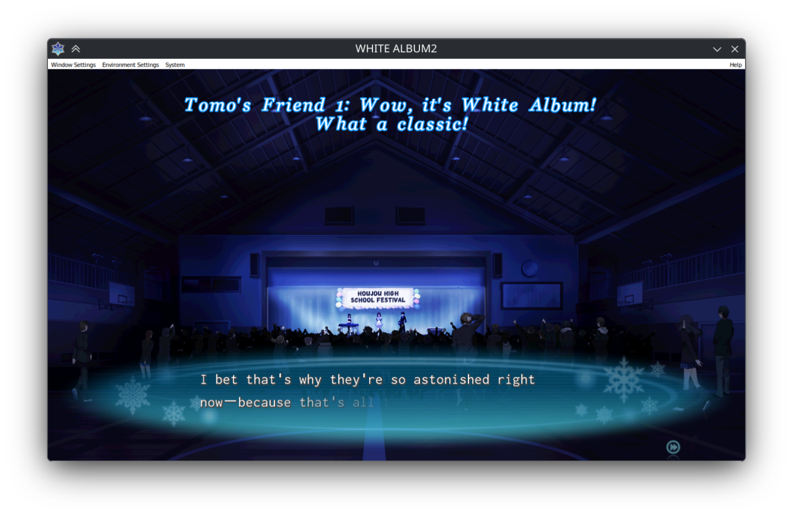
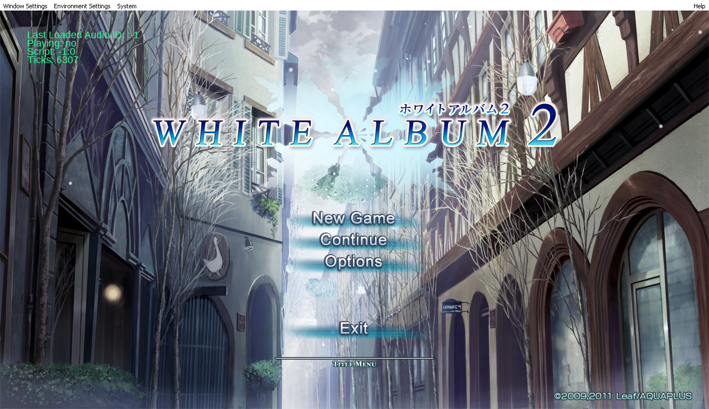

* Revisiting the d3d9.dll from Part 1

In my [[/posts/white_album_2_proton/][previous post]], I described debugging a crash in White Album 2 caused
by a vendored ~d3d9.dll~ that was corrupting the ~lpVtbl~ of a COM object during
~IDirect3DDevice9_Release~. My fix at the time was simple: move the DLL out of
the game's loading path so DXVK's ~d3d9.dll~ would be used directly. The game
stopped crashing and I could play through the visual novel on my Steam Deck.

What I did not fully appreciate at the time was what that ~d3d9.dll~ actually
was. It turns out the DLL is part of the [[https://github.com/TodokanaiTL/subtitles][TodokanaiTL subtitle project]]. The
subtitle system works by proxying ~d3d9.dll~, hooking into the game's rendering
pipeline to overlay translated subtitles during movie scenes. By removing it, I
had fixed the crash but silently broken subtitle rendering. This was reported in
[[https://github.com/Binary-Eater/WhiteAlbum2-Proton-patch-scripts/issues/1][an issue]] on my patch scripts repository. The reporter's workaround was to
disable DXVK entirely with ~PROTON_USE_WINED3D=1~ and use a DLL override, which
avoided the crash but meant giving up DXVK.

#+ATTR_HTML: :width 80%

I wanted to do better than that. Rather than choosing between subtitles and
DXVK, I decided to look at the subtitle DLL's [[https://github.com/TodokanaiTL/subtitles][source code]] and fix the underlying
bugs.

* COM reference counting done wrong

The root cause of the crash from Part 1 was a violation of Microsoft's [[https://learn.microsoft.com/en-us/windows/win32/api/unknwn/nf-unknwn-iunknown-release][COM
reference counting contract]] in the subtitle DLL's wrapper classes. The
~Direct3DWrapper~ and ~Direct3DDeviceWrapper~ classes implement ~IUnknown::Release~
by forwarding the call to the wrapped object, but then unconditionally deleting
the wrapper instance regardless of what the wrapped object's reference count
actually was. Per the COM specification, ~Release~ decrements the reference count
and the object should only be destroyed when the count reaches zero.

This worked fine with ~wined3d~, likely because the reference count patterns in
that code path never exposed the issue. DXVK, however, exposes the issue with
COM object lifetimes. When the subtitle DLL freed its wrapper while the
underlying DXVK object still had outstanding references, the ~lpVtbl~ would get
corrupted, leading to the NULL function pointer dereference I traced in Part 1.

The fix was straightforward: only delete the wrapper instance when the original
object's reference count reaches zero. I submitted this as [[https://github.com/TodokanaiTL/subtitles/pull/1][a pull request]] to
the TodokanaiTL subtitles project.

* Stack memory corruption in getResourcePath

While I was in the code, I found a second bug. ~Utility::getResourcePath~
returned a pointer to a stack-allocated array. This is undefined behavior since
the stack frame is invalidated once the function returns. In practice, the
memory would get clobbered by interweaving stack calls, leading to intermittent
crashes or incorrect subtitle file paths.

The fix changes the interface so that callers provide their own buffer and manage
its lifetime, eliminating the dangling pointer. I submitted this as a [[https://github.com/TodokanaiTL/subtitles/pull/2][separate
pull request]].

* Switching from H.264 to AV1

The original version of my [[https://github.com/Binary-Eater/WhiteAlbum2-Proton-patch-scripts][patch scripts]] converted White Album 2's ASF movie
assets to H.264 encoded mp4 files. This worked at the time, but H.264 licensing
concerns have degraded its support in Proton environments. Valve's [[https://partner.steamgames.com/doc/steamdeck/recommendations][codec
documentation]] recommends AV1 for video and Opus for audio.

I [[https://github.com/Binary-Eater/WhiteAlbum2-Proton-patch-scripts/commit/1ef78a23d3b2d0f6522c3880489c82bbd0332c44][updated the gstreamer patch script]] to encode with ~libsvtav1~ and ~libopus~
instead.

#+BEGIN_SRC shell
  ffmpeg -i "$mv_pak" -c:v libsvtav1 -c:a libopus "${mv_pak}.mp4"
#+END_SRC

* Putting it all together

With the subtitle DLL bugs fixed and the codec conversion updated, the patch
scripts now provide a complete experience: DXVK for rendering, working
subtitles during movie scenes, and AV1 encoded video assets that Proton's
gstreamer stack handles without issue. The [[https://github.com/Binary-Eater/WhiteAlbum2-Proton-patch-scripts/commit/1e84906773d98b7ec828d95e7748a5504ad10a98][updated patch script]] distributes
the corrected subtitle DLL so users do not need to build it from source.

#+BEGIN_SRC shell
  ❯ ./wa2-proton-dxvk-patch.sh <path-to-wa2-install>

  ❯ ./wa2-proton-gstreamer-patch.sh <path-to-wa2-install>
#+END_SRC

No ~PROTON_USE_WINED3D=1~ needed. No DLL overrides. Just patch and play.

#+ATTR_HTML: :width 80%

The image above illustrates the DLL working with some debug output being
rendered on the game. ~wa2-proton-dxvk-patch.sh~ will not copy over the DLL with
the debug output, so the game experience will not be ruined. The DLL with debug
output can also be found in the repository for those interested.
